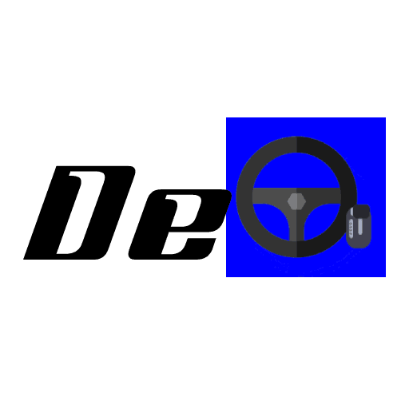
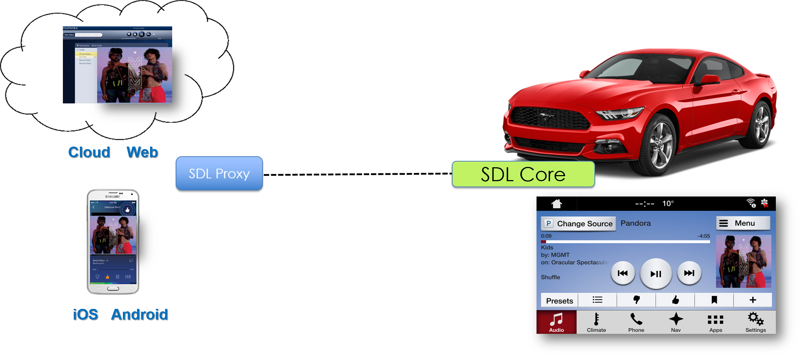
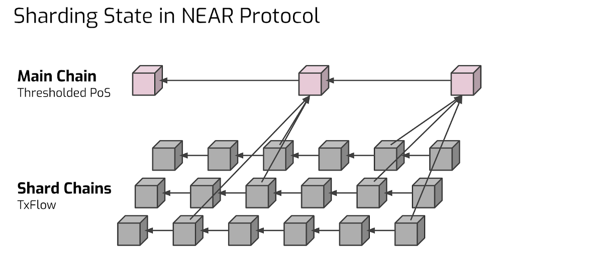
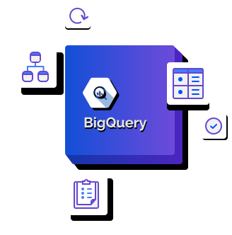

*** 

DeVi or Decentralized Vehicle Initiatives is a DApp...

# Installation 
Install android SDK

## Blockchain
This is how you set up the blockchain and protocol reqs for the DApp

## Vehicle Client
This is how you setup the SDL client 

## Dataset
Used Gas station info https://data.colorado.gov/Energy/Alternative-Fuels-and-Electric-Vehicle-Charging-St/team-3ugz

| FuelID        | Fuel Name    |
| ------------- |:-------------:| 
|BD             | Biodiesel (B20 and above)|
|CNG            | Compressed Natural Gas| 
|E85            | Ethanol |
|ELEC           | Electric|
|HY             | Hydrogen| 
|LNG            | Liquefied Natural Gas| 
|LPG            | Liquefied Petroleum Gas (Propane)|

**Now to go to our website to download binary:**

# Architecture

## Frontend

## Backend

## Database

